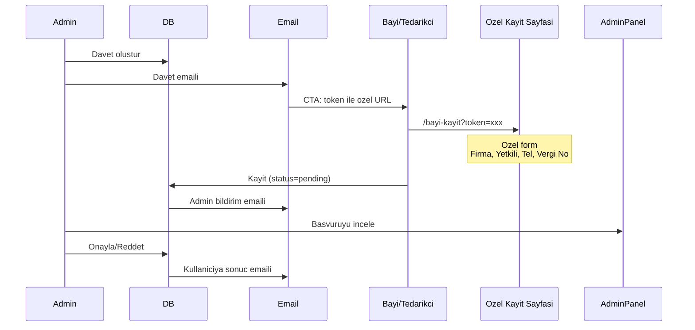

<!-- 9d0525ce-fd09-457d-bda9-60771a004f3e 5f7bf094-8d0c-486e-af9d-3cb4a032d226 -->
# Bayi/Tedarikci Kayit Akisi Yenileme

## Mevcut Sorun

Email CTA butonu `/giris` sayfasina yonlendiriyor. Jenerik kayit formu, onay mekanizmasi yok, admin bildirimi yok.

## Hedef Akis

## Degisiklikler

### 1. Veritabani (Migration)

`dealers` ve `suppliers` tablolarina:

- `approval_status` enum: pending, approved, rejected
- `approval_notes` text (admin notu)
- `approved_at`, `approved_by` kolonlari

Bayi icin ek alanlar:

- `tax_number` (vergi no - opsiyonel)

Tedarikci icin ek alanlar:

- `product_categories` text[] (urun kategorileri)

### 2. Yeni Sayfalar

| Sayfa | URL | Aciklama |

|-------|-----|----------|

| Bayi Kayit | `/bayi-kayit` | Token ile erisim, ozel form |

| Tedarikci Kayit | `/tedarikci-kayit` | Token ile erisim, ozel form |

| Onay Bekleniyor | `/beklemede` | Pending kullanicilar icin |

### 3. Email Sistemi Guncellemeleri

**useEmailService.ts:**

- `signupUrl` degisikligi: `/bayi-kayit?token={invite_id}` veya `/tedarikci-kayit?token={invite_id}`

**Yeni email sablonlari (send-email/index.ts):**

- `admin_new_application`: Admin'e yeni basvuru bildirimi
- `application_approved`: Kullaniciya onay bildirimi
- `application_rejected`: Kullaniciya red bildirimi

### 4. Kayit Sayfalari Mantigi

**BayiKayit.tsx ve TedarikciKayit.tsx:**

1. URL'den token al
2. Token ile `pending_invites` sorgula (RLS guncelleme gerekli - public read for valid token)
3. Token gecersiz/suresi dolmus ise hata goster
4. Form goster: Email (readonly, davetten), Sifre, Firma Adi, Yetkili, Telefon, Vergi No/Kategoriler
5. Supabase Auth signup + ek bilgileri kaydet
6. Kullaniciyi `/beklemede` sayfasina yonlendir

### 5. handle_new_user Trigger Guncelleme

- `approval_status = 'pending'` olarak kayit olustur
- Admin'e email bildirimi gonder (Edge function cagir)

### 6. Admin Panel Degisiklikleri

**Dealers.tsx ve Suppliers.tsx:**

- "Bekleyen Basvurular" sekme/bolumu ekle
- Onay/Red butonlari
- Basvuru detay modal
- Onay notlari girisi

**Yeni hook'lar:**

- `usePendingDealerApplications()`
- `usePendingSupplierApplications()`
- `useApproveDealer()`, `useRejectDealer()`
- `useApproveSupplier()`, `useRejectSupplier()`

### 7. RequireRole Guncelleme

**RequireRole.tsx:**

- Dealer/Supplier icin `approval_status` kontrolu
- Pending ise `/beklemede` sayfasina redirect
- Rejected ise ozel mesaj goster

### 8. AuthContext Guncelleme

- `approvalStatus` state ekle
- Dealer/Supplier icin onay durumunu kontrol et

## Dosya Listesi

### Yeni Dosyalar

- `src/pages/BayiKayit.tsx`
- `src/pages/TedarikciKayit.tsx`
- `src/pages/Beklemede.tsx`
- `src/hooks/useDealerApplications.ts`
- `src/hooks/useSupplierApplications.ts`
- `supabase/migrations/xxx_approval_system.sql`

### Guncellenecek Dosyalar

- `src/App.tsx` (yeni route'lar)
- `src/hooks/useEmailService.ts` (signupUrl, yeni template'ler)
- `src/hooks/useDealers.ts` (onay fonksiyonlari)
- `src/hooks/useSuppliers.ts` (onay fonksiyonlari)
- `src/pages/admin/Dealers.tsx` (onay UI)
- `src/pages/admin/Suppliers.tsx` (onay UI)
- `src/components/auth/RequireRole.tsx` (approval check)
- `src/contexts/AuthContext.tsx` (approval status)
- `supabase/functions/send-email/index.ts` (yeni template'ler)

## Guvenlik Notlari

1. Token sadece bir kez kullanilabilir
2. Token 7 gun gecerli (mevcut)
3. pending_invites icin public SELECT policy (sadece kendi token'i ile)
4. Approval sadece admin yapabilir (RLS)

### To-dos

- [ ] Veritabani migration: approval_status, tax_number, product_categories kolonlari
- [ ] pending_invites icin token bazli public read RLS policy
- [ ] BayiKayit.tsx sayfasi: token dogrulama, ozel form, signup
- [ ] TedarikciKayit.tsx sayfasi: token dogrulama, ozel form, signup
- [ ] Beklemede.tsx sayfasi: onay bekleniyor mesaji
- [ ] useEmailService signupUrl guncelleme: token ile ozel sayfa
- [ ] Yeni email sablonlari: admin_new_application, application_approved/rejected
- [ ] Admin Dealers/Suppliers sayfalarinda onay/red UI
- [ ] RequireRole: approval_status kontrolu ve redirect
- [ ] AuthContext: approvalStatus state ekleme
- [ ] App.tsx: yeni route'lar ekleme