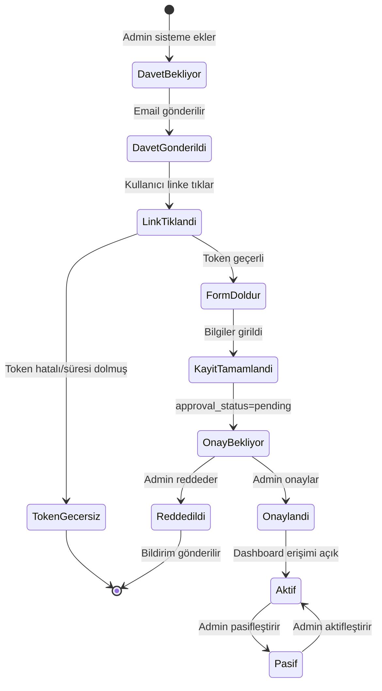
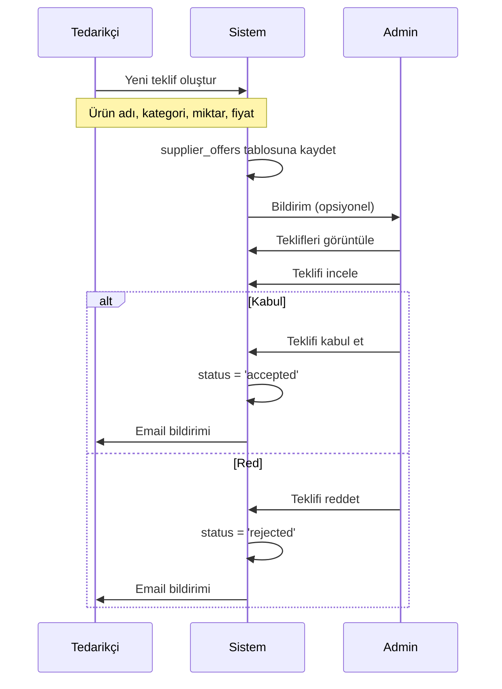

# Bayi ve Tedarikçi Akış Dökümanı

> Bu doküman bayi ve tedarikçi sisteminin iş mantığını, akışlarını ve kurallarını açıklar.

## Genel Bakış

Haldeki platformunda iki özel rol bulunur:

1. **Bayi (Dealer)**: Bölge bazlı teslimat yapan iş ortağı
2. **Tedarikçi (Supplier)**: Ürün tedarik eden çiftlik/toptancı

Her iki rol de **davet sistemi** ile çalışır - doğrudan kayıt yapılamaz.

---

## Bayi/Tedarikçi Yaşam Döngüsü



---

## Bayi Sistemi

### Bayi Nedir?

Bayi, belirli bölgelerde teslimat yapan Haldeki iş ortağıdır. Her bayinin:
- Sorumlu olduğu bölgeler (`region_ids`)
- Kendi müşteri siparişleri
- Teslimat takibi

### Bayi Davet Süreci

```
┌─────────────────────────────────────────────────────────────┐
│  ADMIN PANELİ                                               │
│  ├── Bayiler → Bayi Davet Et                               │
│  ├── Email adresi gir                                       │
│  ├── Firma adı gir                                          │
│  ├── Yetkili bilgileri (opsiyonel)                         │
│  └── Bölgeleri seç                                          │
└─────────────────────────────────────────────────────────────┘
                           ↓
┌─────────────────────────────────────────────────────────────┐
│  SİSTEM                                                     │
│  ├── pending_invites tablosuna kayıt                       │
│  │   └── role: 'dealer'                                    │
│  │   └── dealer_data: {name, region_ids, ...}             │
│  └── Email gönderilir (token ile özel URL)                 │
└─────────────────────────────────────────────────────────────┘
                           ↓
┌─────────────────────────────────────────────────────────────┐
│  KULLANICI                                                  │
│  ├── Email'deki linke tıklar                               │
│  ├── /bayi-kayit?token=xxx açılır                          │
│  ├── Formu doldurur:                                        │
│  │   ├── Şifre                                              │
│  │   ├── Firma adı                                          │
│  │   ├── Yetkili adı                                        │
│  │   ├── Telefon                                            │
│  │   └── Vergi no (opsiyonel)                              │
│  └── Kayıt Ol tıklar                                        │
└─────────────────────────────────────────────────────────────┘
                           ↓
┌─────────────────────────────────────────────────────────────┐
│  SİSTEM (handle_new_user trigger)                           │
│  ├── auth.users'a kayıt                                     │
│  ├── profiles tablosuna kayıt                               │
│  ├── user_roles: dealer rolü atanır                        │
│  ├── dealers tablosuna kayıt                                │
│  │   └── approval_status: 'pending'                        │
│  └── pending_invites: used_at güncellenir                  │
└─────────────────────────────────────────────────────────────┘
                           ↓
┌─────────────────────────────────────────────────────────────┐
│  KULLANICI                                                  │
│  └── /beklemede sayfasına yönlendirilir                    │
└─────────────────────────────────────────────────────────────┘
```

### Bayi Onay Süreci

```
┌─────────────────────────────────────────────────────────────┐
│  ADMIN PANELİ                                               │
│  ├── Bayiler sayfası                                        │
│  ├── "Onay Bekleyen Başvurular" bölümü                     │
│  ├── Başvuruyu incele:                                      │
│  │   ├── Firma adı                                          │
│  │   ├── Yetkili bilgileri                                  │
│  │   ├── Telefon                                            │
│  │   ├── Vergi no                                           │
│  │   └── Seçilen bölgeler                                   │
│  └── Karar ver: Onayla / Reddet                            │
└─────────────────────────────────────────────────────────────┘
                           ↓
                    ┌──────┴──────┐
                    ↓             ↓
┌─────────────────────────┐ ┌─────────────────────────┐
│  ONAYLA                 │ │  REDDET                 │
│  ├── Not ekle (ops.)   │ │  ├── Sebep yaz (ops.)  │
│  ├── approval_status   │ │  ├── approval_status   │
│  │   = 'approved'      │ │  │   = 'rejected'      │
│  ├── approved_at = now │ │  ├── approved_at = now │
│  ├── approved_by = uid │ │  ├── approved_by = uid │
│  └── Email gönder      │ │  └── Email gönder      │
└─────────────────────────┘ └─────────────────────────┘
```

### Bayi Yetkileri

| Yetki | Açıklama |
|-------|----------|
| Dashboard Erişimi | `/bayi` sayfasına erişim |
| Sipariş Görüntüleme | Kendi bölgelerindeki siparişler |
| Sipariş Durumu Güncelleme | Hazırlanıyor, Yolda, Teslim Edildi |
| Profil Güncelleme | Kendi bilgilerini düzenleme |

### Bayi-Bölge İlişkisi

- Her bayinin `region_ids` array'i var
- Bir bayi birden fazla bölgeye hizmet verebilir
- Bir bölgede birden fazla bayi olabilir
- Sipariş geldiğinde bölgeye atanmış bayilere bildirim gider

---

## Tedarikçi Sistemi

### Tedarikçi Nedir?

Tedarikçi, Haldeki'ye ürün tedarik eden çiftlik veya toptancıdır. Her tedarikçinin:
- Uzman olduğu kategoriler (`product_categories`)
- Teklif gönderme yetkisi
- Kabul edilen teklifler → sisteme ürün olarak eklenir

### Tedarikçi Davet Süreci

Bayi süreci ile benzer:
- Email davet
- `/tedarikci-kayit?token=xxx` sayfası
- Ek bilgi: Ürün kategorileri (checkbox)
- Onay bekleme süreci

### Tedarikçi Teklif Akışı



### Tedarikçi Yetkileri

| Yetki | Açıklama |
|-------|----------|
| Dashboard Erişimi | `/tedarikci` sayfasına erişim |
| Teklif Oluşturma | Yeni ürün teklifi gönderme |
| Teklif Görüntüleme | Kendi tekliflerini listeleme |
| Profil Güncelleme | Kendi bilgilerini düzenleme |

---

## Onay Durumları

### pending (Beklemede)

- Kullanıcı kayıt olmuş ama henüz onaylanmamış
- Dashboard'a erişemez
- `/beklemede` sayfasını görür
- Admin incelemesi bekliyor

### approved (Onaylandı)

- Admin onaylamış
- Dashboard'a tam erişim
- İlgili işlemleri yapabilir
- Email ile bilgilendirilir

### rejected (Reddedildi)

- Admin reddetmiş
- Dashboard'a erişemez
- `/beklemede` sayfasında red mesajı görür
- Email ile bilgilendirilir
- İletişim sayfasına yönlendirilir

---

## Güvenlik Kuralları

### RLS Politikaları

```sql
-- Bayiler sadece kendi kaydını görebilir
CREATE POLICY "Dealers can view own record" ON dealers
FOR SELECT USING (auth.uid() = user_id);

-- Adminler tüm bayileri yönetebilir
CREATE POLICY "Admins can manage dealers" ON dealers
FOR ALL USING (has_role(auth.uid(), 'admin'));
```

### RequireRole Kontrolü

```typescript
// Bayi dashboard'u için
<RequireRole allowedRoles={['dealer']} requireApproval={true}>
  <DealerDashboard />
</RequireRole>

// requireApproval=true olduğunda:
// - approval_status kontrol edilir
// - pending veya rejected ise /beklemede'ye yönlendirilir
```

---

## İş Kuralları

### Davet Kuralları

1. Aynı email-rol kombinasyonu için tek aktif davet olabilir
2. Davet 7 gün geçerlidir (`expires_at`)
3. Kullanılan davet yeniden kullanılamaz (`used_at`)
4. Süresi dolan davetler otomatik geçersiz sayılır

### Onay Kuralları

1. Yeni kayıt her zaman `pending` ile başlar
2. Sadece admin onaylayabilir/reddedebilir
3. Onay/red işlemi geri alınamaz (yeni kayıt gerekir)
4. Onay notu kayıt altına alınır

### Aktivasyon Kuralları

1. Onaylanan kullanıcı `is_active=true` ile başlar
2. Admin istediği zaman pasifleştirebilir
3. Pasif kullanıcı giriş yapabilir ama işlem yapamaz

---

## Email Bildirimleri

| Olay | Alıcı | Template |
|------|-------|----------|
| Davet oluşturuldu | Davet edilen | `dealer_invite` / `supplier_invite` |
| Başvuru onaylandı | Bayi/Tedarikçi | `application_approved` |
| Başvuru reddedildi | Bayi/Tedarikçi | `application_rejected` |
| Yeni başvuru (opsiyonel) | Admin | `admin_new_application` |

---

## Gelecek Geliştirmeler

- [ ] Başvuru detay sayfası (daha fazla bilgi görüntüleme)
- [ ] Eksik bilgi talebi (düzenleme isteği)
- [ ] Çoklu admin onayı (4 göz prensibi)
- [ ] Otomatik ön kontrol (vergi no doğrulama vb.)
- [ ] Bayi performans metrikleri
- [ ] Tedarikçi değerlendirme sistemi

---

Son güncelleme: 2025-12-26

