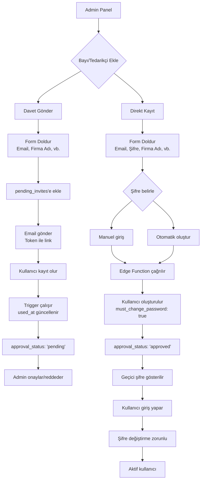
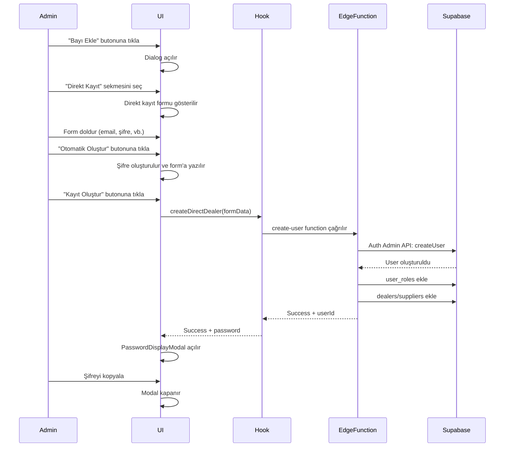
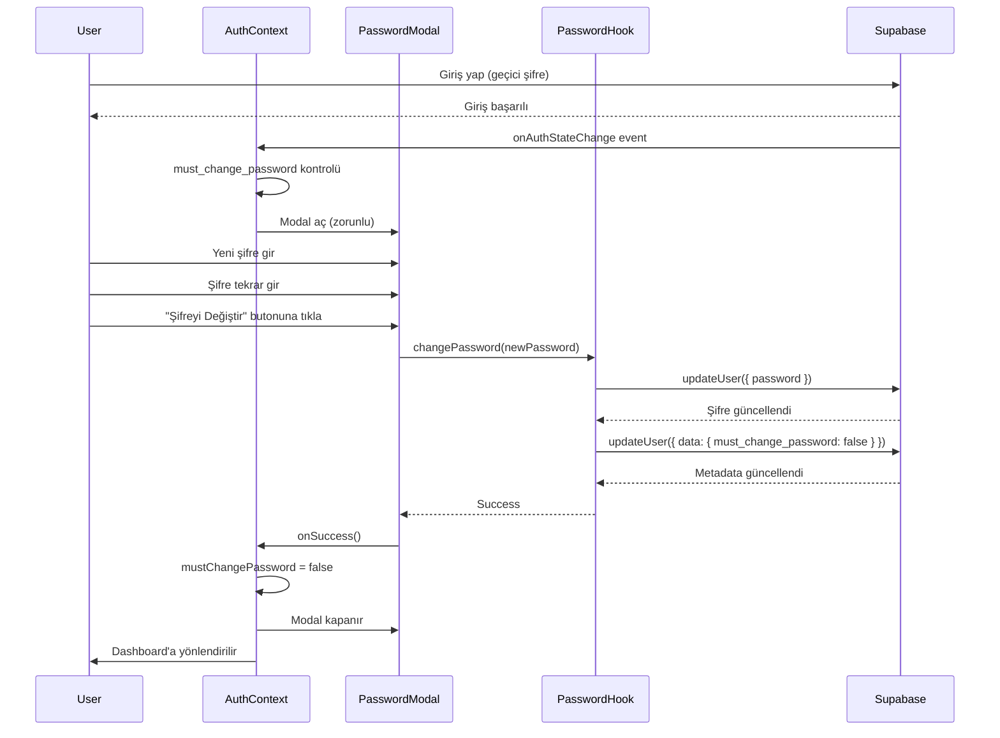

# Admin Kayıt Akışları Diyagramı

## Genel Akış

```mermaid
flowchart TD
    A[Admin Panel] --> B{Bayı/Tedarikçi Ekle}
    B --> C[Davet Gönder]
    B --> D[Direkt Kayıt]
    
    C --> E[Form Doldur<br/>Email, Firma Adı, vb.]
    E --> F[pending_invites'e ekle]
    F --> G[Email gönder<br/>Token ile link]
    G --> H[Kullanıcı kayıt olur]
    H --> I[Trigger çalışır<br/>used_at güncellenir]
    I --> J[approval_status: 'pending']
    J --> K[Admin onaylar/reddeder]
    
    D --> L[Form Doldur<br/>Email, Şifre, Firma Adı, vb.]
    L --> M{Şifre belirle}
    M --> N[Manuel giriş]
    M --> O[Otomatik oluştur]
    N --> P[Edge Function çağrılır]
    O --> P
    P --> Q[Kullanıcı oluşturulur<br/>must_change_password: true]
    Q --> R[approval_status: 'approved']
    R --> S[Geçici şifre gösterilir]
    S --> T[Kullanıcı giriş yapar]
    T --> U[Şifre değiştirme zorunlu]
    U --> V[Aktif kullanıcı]
```

## UI Akışı

```mermaid
sequenceDiagram
    participant Admin
    participant UI
    participant Hook
    participant EdgeFunction
    participant Supabase
    
    Admin->>UI: "Bayı Ekle" butonuna tıkla
    UI->>UI: Dialog açılır
    Admin->>UI: "Direkt Kayıt" sekmesini seç
    UI->>UI: Direkt kayıt formu gösterilir
    Admin->>UI: Form doldur (email, şifre, vb.)
    Admin->>UI: "Otomatik Oluştur" butonuna tıkla
    UI->>UI: Şifre oluşturulur ve form'a yazılır
    Admin->>UI: "Kayıt Oluştur" butonuna tıkla
    UI->>Hook: createDirectDealer(formData)
    Hook->>EdgeFunction: create-user function çağrılır
    EdgeFunction->>Supabase: Auth Admin API: createUser
    Supabase-->>EdgeFunction: User oluşturuldu
    EdgeFunction->>Supabase: user_roles ekle
    EdgeFunction->>Supabase: dealers/suppliers ekle
    EdgeFunction-->>Hook: Success + userId
    Hook-->>UI: Success + password
    UI->>UI: PasswordDisplayModal açılır
    Admin->>UI: Şifreyi kopyala
    UI->>UI: Modal kapanır
```

## Şifre Değiştirme Akışı

```mermaid
sequenceDiagram
    participant User
    participant AuthContext
    participant PasswordModal
    participant PasswordHook
    participant Supabase
    
    User->>Supabase: Giriş yap (geçici şifre)
    Supabase-->>User: Giriş başarılı
    Supabase->>AuthContext: onAuthStateChange event
    AuthContext->>AuthContext: must_change_password kontrolü
    AuthContext->>PasswordModal: Modal aç (zorunlu)
    User->>PasswordModal: Yeni şifre gir
    User->>PasswordModal: Şifre tekrar gir
    User->>PasswordModal: "Şifreyi Değiştir" butonuna tıkla
    PasswordModal->>PasswordHook: changePassword(newPassword)
    PasswordHook->>Supabase: updateUser({ password })
    Supabase-->>PasswordHook: Şifre güncellendi
    PasswordHook->>Supabase: updateUser({ data: { must_change_password: false } })
    Supabase-->>PasswordHook: Metadata güncellendi
    PasswordHook-->>PasswordModal: Success
    PasswordModal->>AuthContext: onSuccess()
    AuthContext->>AuthContext: mustChangePassword = false
    AuthContext->>PasswordModal: Modal kapanır
    AuthContext->>User: Dashboard'a yönlendirilir
```

