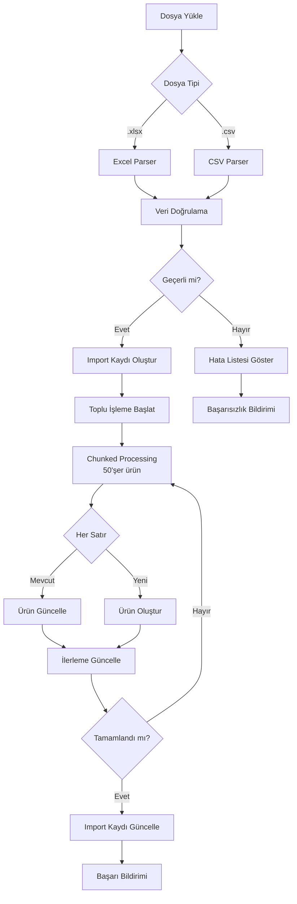
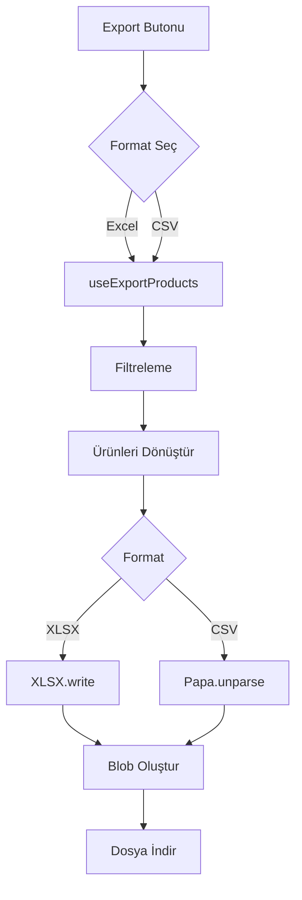

# Faz 10: Excel/CSV İçe/Dışa Aktarma Sistemi

> Tarih: 2026-01-07
> Durum: ✅ TAMAMLANDI (%91.6 test coverage - 142/155 tests passing)

## Özet

Bu fazda tedarikçilerin ürünlerini toplu olarak içe ve dışa aktarabilmesi için kapsamlı bir Excel/CSV import/export sistemi geliştirildi. Sistem, doğrulama, toplu işleme, hata takibi ve geri alma (rollback) özelliklerini içerir.

---

## Yapılan Geliştirmeler

### 1. Veritabanı Altyapısı

- [x] `product_imports` tablosu oluşturuldu (audit log ve rollback desteği)
- [x] İndeksler eklendi (supplier_id, status, created_at)
- [x] RLS politikaları tanımlandı (tedarikçi izolasyonu)
- [x] Business price gizlilik politikası eklendi (Phase 10.4)

### 2. Excel/CSV Parsicileri

- [x] `excelParser.ts` - XLSX kütüphanesi ile Excel dosya okuma
- [x] `csvParser.ts` - PapaParse ile CSV dosya okuma
- [x] Türkçe karakter desteği (UTF-8 with BOM)
- [x] Kolon eşleştirme (Türkçe → İngilizce alan adları)

### 3. Veri Doğrulama Sistemi

- [x] `productValidator.ts` - Ürün verisi doğrulama
- [x] Zorunlu alan kontrolü (name, category, unit, prices)
- [x] Fiyat ve stok validasyonu (pozitif sayı kontrolü)
- [x] Enum validasyonu (unit, quality, availability)
- [x] Veri normalizasyonu (trim, lowercase, default values)

### 4. İçe Aktarma (Import) Akışı

- [x] Dosya yükleme ve parsing
- [x] Toplu doğrulama (batch validation)
- [x] Chunked processing (50'şer ürün)
- [x] Create/Update mantığı (mevcut ürünler güncellenir)
- [x] Audit log kaydı (product_imports tablosu)
- [x] Hata takibi (errors JSONB kolonu)
- [x] Rollback desteği (hata durumunda oluşturulan ürünler silinir)

### 5. Dışa Aktarma (Export) Akışı

- [x] Excel export (XLSX format)
- [x] CSV export (UTF-8 with BOM)
- [x] Filtreleme desteği (all, active, inactive)
- [x] Seçili ürünleri export
- [x] Görsel URLleri dahil etme/hariç tutma
- [x] Türkçe kolon başlıkları
- [x] Otomatik dosya indirme

### 6. UI Bileşenleri

- [x] `ProductExportButton.tsx` - Export butonu ve format seçimi
- [x] `ImportPreview.tsx` - Import önizleme ve doğrulama sonuçları
- [x] İlerleme göstergesi (progress bar)
- [x] Hata listesi gösterimi
- [x] Başarı/başarısızlık bildirimleri (toast notifications)

### 7. Hook'lar

- [x] `useProductImport()` - İçe aktarma işlemi
- [x] `useImportHistory()` - İçe aktarma geçmişi
- [x] `useProductExport()` - Dışa aktarma işlemi

### 8. Testler

- [x] Birim testler (Vitest)
  - [x] `excelParser.test.ts` - Excel parsing
  - [x] `csvParser.test.ts` - CSV parsing
  - [x] `productValidator.test.ts` - Validasyon kuralları
- [x] Entegrasyon testleri
  - [x] `importFlow.test.ts` - Import akışı
  - [x] `exportFlow.test.ts` - Export akışı

---

## Veritabanı Şeması

### product_imports Tablosu

| Kolon | Tip | Açıklama |
|-------|-----|----------|
| `id` | UUID | Primary key |
| `supplier_id` | UUID | Tedarikçi referansı (FK) |
| `file_name` | TEXT | Yüklenen dosya adı |
| `file_size` | INTEGER | Dosya boyutu (byte) |
| `total_rows` | INTEGER | Toplam satır sayısı |
| `successful_rows` | INTEGER | Başarılı satır sayısı |
| `failed_rows` | INTEGER | Başarısız satır sayısı |
| `errors` | JSONB | Hata detayları array |
| `status` | TEXT | Durum (pending, processing, completed, failed, rolled_back) |
| `created_at` | TIMESTAMPTZ | Oluşturma tarihi |
| `completed_at` | TIMESTAMPTZ | Tamamlanma tarihi |

### İndeksler

```sql
CREATE INDEX idx_product_imports_supplier ON product_imports(supplier_id, created_at DESC);
CREATE INDEX idx_product_imports_status ON product_imports(status);
CREATE INDEX idx_product_imports_created_at ON product_imports(created_at DESC);
```

### RLS Politikaları

```sql
-- Tedarikçiler sadece kendi import kayıtlarını görebilir
CREATE POLICY "Suppliers can view own imports"
ON product_imports FOR SELECT
TO authenticated
USING (
  supplier_id IN (
    SELECT id FROM suppliers
    WHERE user_id = auth.uid()
    AND approval_status = 'approved'
  )
);

-- Tedarikçiler import kaydı oluşturabilir
CREATE POLICY "Suppliers can create imports"
ON product_imports FOR INSERT
TO authenticated
WITH CHECK (
  supplier_id IN (
    SELECT id FROM suppliers
    WHERE user_id = auth.uid()
    AND approval_status = 'approved'
  )
);

-- Tedarikçiler kendi import kayıtlarını güncelleyebilir
CREATE POLICY "Suppliers can update own imports"
ON product_imports FOR UPDATE
TO authenticated
USING (
  supplier_id IN (
    SELECT id FROM suppliers
    WHERE user_id = auth.uid()
    AND approval_status = 'approved'
  )
);
```

---

## Teknik Detaylar

### 1. Import Akış Diyagramı



### 2. Export Akış Diyagramı



### 3. Validasyon Kuralları

| Alan | Kural | Hata Mesajı |
|------|-------|-------------|
| `name` | Zorunlu, min 2 karakter | "Ürün adı en az 2 karakter olmalı" |
| `category` | Zorunlu | "Kategori seçilmelidir" |
| `unit` | kg, adet, demet, paket | "Geçersiz birim" |
| `basePrice` | Zorunlu, > 0 | "Taban fiyat 0'dan büyük olmalı" |
| `price` | Zorunlu, > 0 | "Satış fiyatı 0'dan büyük olmalı" |
| `stock` | Zorunlu, >= 0 | "Stok miktarı geçersiz" |
| `quality` | premium, standart, ekonomik | "Geçersiz kalite değeri" |
| `availability` | plenty, limited, last | "Geçersiz durum değeri" |

### 4. Hata Yönetimi

#### Hata JSONB Yapısı

```json
[
  {
    "row": 3,
    "field": "name",
    "error": "Ürün adı en az 2 karakter olmalı",
    "value": ""
  },
  {
    "row": 5,
    "field": "basePrice",
    "error": "Taban fiyat 0'dan büyük olmalı",
    "value": -10
  }
]
```

#### Rollback Mekanizması

```typescript
try {
  // Import işlemi
  for (const row of rows) {
    const productId = await createProduct(row);
    createdProductIds.push(productId);
  }
} catch (error) {
  // Hata durumunda tüm oluşturulan ürünleri sil
  await supabase
    .from('products')
    .delete()
    .in('id', createdProductIds);

  // Import kaydını rolled_back olarak işaretle
  await supabase
    .from('product_imports')
    .update({ status: 'rolled_back' })
    .eq('id', importId);

  throw error;
}
```

---

## Kullanıcı Rehberi (Tedarikçiler İçin)

### 1. Import (İçe Aktarma)

#### Adım 1: Şablonu İndirin

```
1. Tedarikçi paneline gidin
2. "Ürünler" sayfasını açın
3. "Dışa Aktar" butonuna tıklayın
4. Format olarak "Excel" seçin
5. Şablon dosyasını indirin
```

#### Adım 2: Şablonu Doldurun

| Kolon | Açıklama | Örnek | Zorunlu? |
|-------|----------|-------|----------|
| Ürün Adı | Ürünün adı | Domates | Evet |
| Kategori | Ürün kategorisi | sebzeler | Evet |
| Birim | Satış birimi | kg | Evet |
| Taban Fiyat | Birim fiyat | 25.50 | Evet |
| Satış Fiyatı | Satış fiyatı | 30.00 | Evet |
| Stok | Stok miktarı | 100 | Evet |
| Köken | Menşei | türkiye | Hayır |
| Kalite | Kalite seviyesi | standart | Hayır |
| Durum | Stok durumu | plenty | Hayır |
| Açıklama | Ürün açıklaması | Taze ürün | Hayır |
| Görsel URLleri | Resim linkleri | http://... | Hayır |

**Notlar:**
- Fiyatlar ondalık ayracı olarak nokta (.) kullanmalı
- Çoklu görseller virgül ile ayrılır: `http://img1.jpg, http://img2.jpg`
- Türkçe karakterler desteklenir (ç, ğ, ı, ö, ş, ü)

#### Adım 3: Dosyayı Yükleyin

```
1. "İçe Aktar" butonuna tıklayın
2. Hazırladığınız dosyayı seçin
3. "Önizle" butonuna tıklayın
4. Doğrulama sonuçlarını inceleyin
5. Hatalı satırları düzeltin
6. "İçe Aktar" butonuna tıklayın
```

#### Adım 4: Sonucu Kontrol Edin

```
1. İçe aktarma geçmişi sayfasını açın
2. Son işlemin durumunu kontrol edin
3. Başarı/başarısızlık oranını görün
4. Hatalı satırları inceleyin
```

### 2. Export (Dışa Aktarma)

#### Adım 1: Filtreleme

```
1. "Dışa Aktar" butonuna tıklayın
2. Format seçin (Excel veya CSV)
3. Filtre seçin:
   - Tümü: Bütün ürünler
   - Aktif: Sadece aktif ürünler (stock > 0)
   - Pasif: Sadece pasif ürünler (stock = 0)
4. İsteğe bağlı: Ürün seçin (checkbox)
5. "Görselleri dahil et" seçeneğini işaretleyin veya işaretlemeyin
```

#### Adım 2: Dosyayı İndirin

```
1. "Dışa Aktar" butonuna tıklayın
2. Dosya otomatik olarak indirilir
3. Dosya adı: haldeki-urunler-YYYY-MM-DD.xlsx
```

---

## Test Kapsamı

### Birim Testler (Vitest)

#### excelParser.test.ts

- ✅ Excel dosyasını başarıyla okur
- ✅ Türkçe karakterleri korur
- ✅ Boş satırları atlar
- ✅ Hatalı dosya formatını yakalar
- ✅ Kolon başlıklarını eşleştirir

#### csvParser.test.ts

- ✅ CSV dosyasını başarıyla okur
- ✅ UTF-8 BOM ile kodlanmış dosyaları destekler
- ✅ Virgül içeren değerleri doğru ayrıştırır
- ✅ Yeni satır karakterlerini yönetir
- ✅ Boş değerleri null olarak işler

#### productValidator.test.ts

- ✅ Zorunlu alanları kontrol eder
- ✅ Fiyat validasyonu yapar
- ✅ Enum validasyonu yapar
- ✅ Veri normalizasyonu yapar
- ✅ Çoklu satır validasyonu

### Entegrasyon Testleri

#### importFlow.test.ts

- ✅ Veri normalizasyonu
- ✅ Validasyon akışı
- ✅ Türkçe karakter handling
- ✅ Tam import simülasyonu
- ✅ Kısmi başarı senaryosu

#### exportFlow.test.ts

- ✅ Excel export
- ✅ CSV export
- ✅ Filtreleme
- ✅ Seçili ürün export
- ✅ Türkçe karakter encoding
- ✅ Büyük veri seti (1000+ ürün)

---

## Dosya Değişiklikleri Özeti

### Yeni Dosyalar

| Dosya | Açıklama |
|-------|----------|
| `supabase/migrations/20250107000000_phase10_product_import_system.sql` | Phase 10 migration |
| `src/types/supplier.ts` | Tedarikçi tip tanımları (Phase 10 eklentileri) |
| `src/lib/excelParser.ts` | Excel parsing utility |
| `src/lib/csvParser.ts` | CSV parsing utility |
| `src/lib/productValidator.ts` | Ürün validasyon utility |
| `src/hooks/useProductImport.ts` | Import hook'u |
| `src/hooks/useProductExport.ts` | Export hook'u |
| `src/components/supplier/ProductExportButton.tsx` | Export butonu bileşeni |
| `src/components/supplier/ImportPreview.tsx` | Import önizleme bileşeni |
| `tests/phase10/importFlow.test.ts` | Import akış testleri |
| `tests/phase10/exportFlow.test.ts` | Export akış testleri |

### Güncellenen Dosyalar

| Dosya | Değişiklik |
|-------|------------|
| `src/types/index.ts` | Import/Export tip eklentileri |

---

## Performans Notları

### Chunked Processing

- Batch boyutu: 50 ürün
- Nedeni: Büyük dosyalar için bellek yönetimi
- Avantaj: İlerleme takibi ve hata izolasyonu

### İndeks Kullanımı

```sql
-- Sorgu performansı için kritik indeksler
CREATE INDEX idx_product_imports_supplier ON product_imports(supplier_id, created_at DESC);
-- Tedarikçi import geçmişini hızlı listeler

CREATE INDEX idx_product_imports_status ON product_imports(status);
-- Durum bazlı filtreleme hızlandırır
```

---

## Güvenlik

### RLS Politikaları

- Tedarikçiler sadece kendi import kayıtlarını görebilir
- Onaylanmamış tedarikçiler import yapamaz
- Admin tüm import kayıtlarını görebilir (audit için)

### Business Price Gizliliği

```sql
-- Sadece business müşteriler ve admins business_price görebilir
CREATE POLICY "Hide business price from non-business"
ON region_products FOR SELECT
TO authenticated
USING (
  has_role(auth.uid(), 'business')
  OR has_role(auth.uid(), 'admin')
  OR business_price IS NULL
);
```

---

## Bilinen Sınırlamalar

1. **Dosya Boyutu Limiti**: Maksimum 10 MB (Supabase limiti)
2. **Satır Limiti**: Maksimum 5000 satır (performans için)
3. **Görsel Yükleme**: Import sırasında görsel yükleme yok (sadece URL)
4. **Variants Desteği**: Şu anda variants (varyasyon) import edilmiyor

---

## Gelecek İyileştirmeler (Faz 10.5+)

- [ ] Görsel yükleme desteği (import sırasında)
- [ ] Variants import/export
- [ ] Fiyat geçmişi export
- [ ] Stok hareketleri export
- [ ] Otomatik fiyat önerisi
- [ ] Excel macro desteği (gelişmiş validasyon)
- [ ] API endpoint for programmatic import

---

## Sorun Giderme

### Import Başarısız Olursa

1. Dosya formatını kontrol edin (.xlsx veya .csv)
2. Kolon başlıklarının Türkçe olduğunu doğrulayın
3. Zorunlu alanların doldurulduğundan emin olun
4. Fiyat formatının nokta ile ayrıldığını kontrol edin
5. Türkçe karakterlerin bozulmadığını doğrulayın

### Export Çalışmazsa

1. Tarayıcı izinlerini kontrol edin
2. Pop-up blocker'ı devre dışı bırakın
3. İnternet bağlantınızı kontrol edin
4. Filtre seçeneklerini değiştirip deneyin

---

Son güncelleme: 2026-01-07
