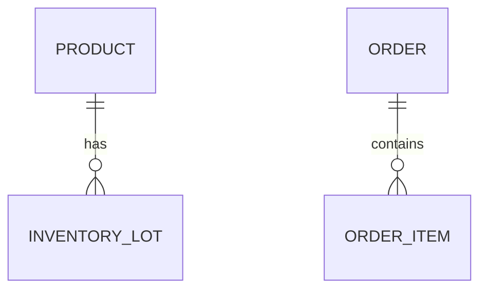
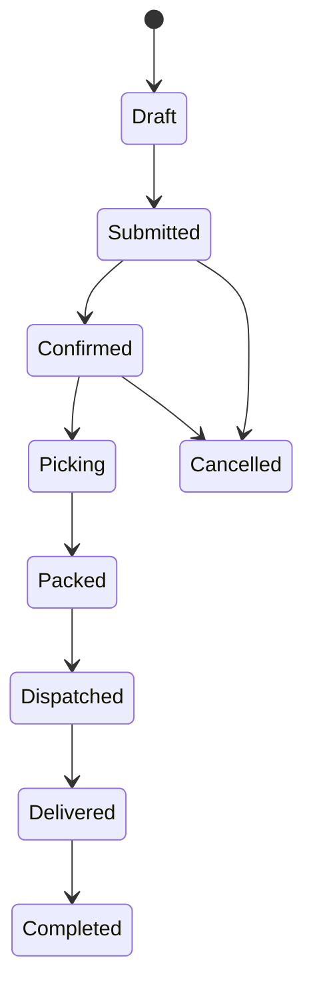

# Domain Model Template

> Dosya: `docs/02-domain/domain-model.md`

## 1) Amaç
Domain’i ortak bir dil ve net entity’lerle tanımlamak.

## 2) Bounded Contexts
- Catalog
- Pricing
- Inventory
- Ordering
- Fulfillment
- Partner Management
- Identity

## 3) Entity Listesi
Her entity için:
- Tanım
- Alanlar (high-level)
- İlişkiler
- Kurallar

Örnek:
### Product
- Tanım:
- Alanlar:
- İlişkiler:
- Kurallar:

## 4) İlişki Diyagramı

## 5) Order Lifecycle

## 6) Açık Sorular ve Riskler
- ...
