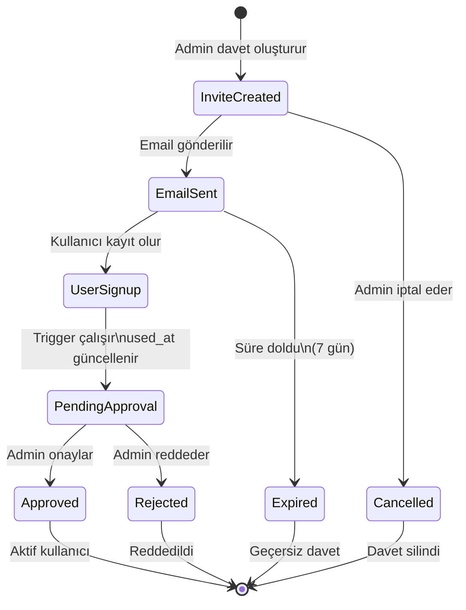
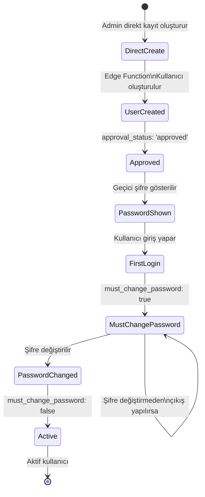
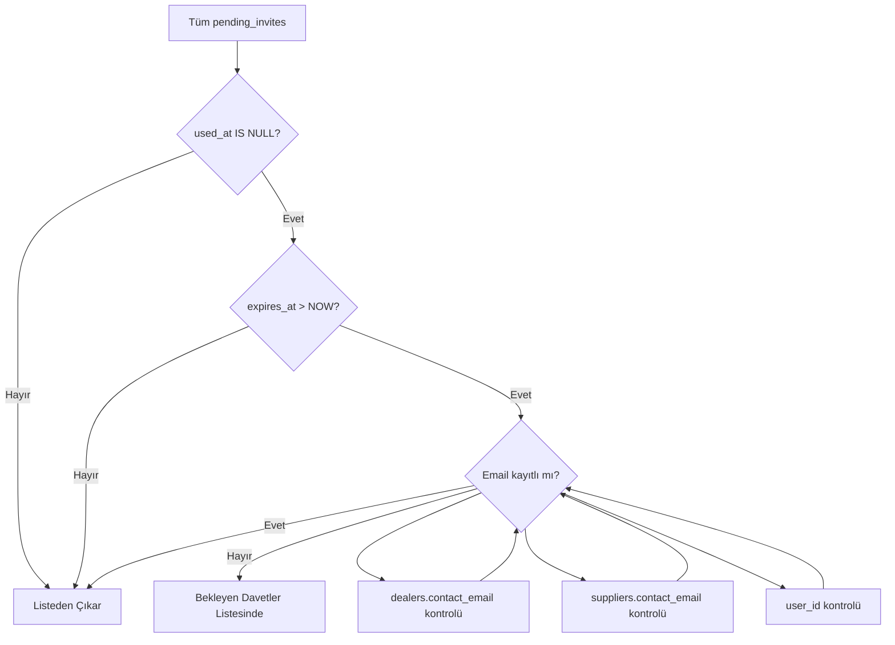

# Davet Yaşam Döngüsü Diyagramı

## Mermaid Diagram

```mermaid
stateDiagram-v2
    [*] --> InviteCreated: Admin davet oluşturur
    InviteCreated --> EmailSent: Email gönderilir
    EmailSent --> UserSignup: Kullanıcı kayıt olur
    UserSignup --> PendingApproval: Trigger çalışır\nused_at güncellenir
    PendingApproval --> Approved: Admin onaylar
    PendingApproval --> Rejected: Admin reddeder
    Approved --> [*]: Aktif kullanıcı
    Rejected --> [*]: Reddedildi
    
    InviteCreated --> Cancelled: Admin iptal eder
    Cancelled --> [*]: Davet silindi
    
    EmailSent --> Expired: Süre doldu\n(7 gün)
    Expired --> [*]: Geçersiz davet
```

## Direkt Kayıt Akışı

```mermaid
stateDiagram-v2
    [*] --> DirectCreate: Admin direkt kayıt oluşturur
    DirectCreate --> UserCreated: Edge Function\nKullanıcı oluşturulur
    UserCreated --> Approved: approval_status: 'approved'
    Approved --> PasswordShown: Geçici şifre gösterilir
    PasswordShown --> FirstLogin: Kullanıcı giriş yapar
    FirstLogin --> MustChangePassword: must_change_password: true
    MustChangePassword --> PasswordChanged: Şifre değiştirilir
    PasswordChanged --> Active: must_change_password: false
    Active --> [*]: Aktif kullanıcı
    
    MustChangePassword --> MustChangePassword: Şifre değiştirmeden\nçıkış yapılırsa
```

## Filtreleme Mantığı

```mermaid
flowchart TD
    A[Tüm pending_invites] --> B{used_at IS NULL?}
    B -->|Hayır| C[Listeden Çıkar]
    B -->|Evet| D{expires_at > NOW?}
    D -->|Hayır| C
    D -->|Evet| E{Email kayıtlı mı?}
    E -->|Evet| C
    E -->|Hayır| F[Bekleyen Davetler Listesinde]
    
    E --> G[dealers.contact_email kontrolü]
    E --> H[suppliers.contact_email kontrolü]
    E --> I[user_id kontrolü]
    G --> E
    H --> E
    I --> E
```

