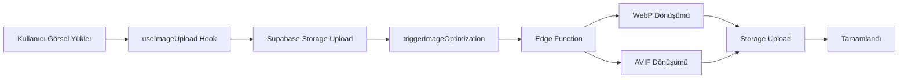

# FAZ 1.2 - Phase 2: Görsel Optimizasyon Edge Function - Teslimat Dokümanı

## Genel Bakış

Bu doküman, FAZ 1.2 Phase 2 kapsamında geliştirilen Supabase Edge Function tabanlı görsel optimizasyon sisteminin teslimat detaylarını içerir.

## Amaç

Ürün görsellerini otomatik olarak modern formatlara (WebP, AVIF) dönüştürerek sayfa yükleme sürelerini optimize etmek.

## Teslim Edilen Dosyalar

### 1. Edge Function
**Dosya:** `supabase/functions/optimize-image/index.ts`

Supabase Edge Function - Görsel optimizasyon işlemini gerçekleştirir.

**Özellikler:**
- Orijinal görseli storage'dan indirir
- WebP formatına dönüştürür (80% kalite)
- AVIF formatına dönüştürür (65% kalite)
- Dönüştürülen görselleri storage'a yükler
- CORS desteği
- Hata yönetimi ve logging

**Teknolojiler:**
- Deno runtime
- Sharp kütüphanesi (görsel işleme)
- Supabase Storage SDK

### 2. Database Migration
**Dosya:** `supabase/migrations/20260110150000_image_optimization_trigger.sql`

Storage üzerinde görsel yüklendiğinde otomatik optimizasyon tetikleyicisi.

**İçerik:**
- `storage.trigger_image_optimization()` fonksiyonu
- INSERT trigger'ı
- Manuel optimizasyon fonksiyonu
- Test query'leri

### 3. Güncellenen Upload Hook
**Dosya:** `src/hooks/useImageUpload.ts`

Görsel yükleme sonrası otomatik optimizasyon tetikleme özelliği eklendi.

**Değişiklikler:**
- `triggerImageOptimization()` fonksiyonu eklendi
- `uploadImage()` fonksiyonuna optimizasyon çağrısı eklendi
- Türkçe yorumlar eklendi

### 4. Dokümantasyon
**Dosya:** `supabase/functions/optimize-image/README.md`

Kurulum, kullanım ve test talimatları.

## Çalışma Akışı



## Teknik Detaylar

### Görsel Formatları

| Format | Kalite | Boyut Tasarrufu | Tarayıcı Desteği |
|--------|--------|-----------------|------------------|
| Orijinal | 100% | 0% | %100 |
| WebP | 80% | ~40% | %95+ |
| AVIF | 65% | ~60% | %75+ |

### API Endpoint

```
POST /functions/v1/optimize-image
Content-Type: application/json
Authorization: Bearer <token>

{
  "bucketId": "product-images",
  "path": "user-123/image-456.jpg"
}
```

### Response

```json
{
  "success": true,
  "message": "Görsel optimizasyonu tamamlandı",
  "optimizedFormats": {
    "webp": "user-123/image-456.webp",
    "avif": "user-123/image-456.avif"
  }
}
```

## Kurulum Talimatları

### 1. Edge Function'ı Deploy Edin

```bash
# Local development
supabase functions serve optimize-image

# Production
supabase functions deploy optimize-image
```

### 2. Migration'ı Çalıştırın

```bash
supabase db push
```

### 3. Storage Hook Oluşturun (Opsiyonel)

```bash
supabase storage hook create product-images INSERT optimize-image
```

VEYA Supabase Dashboard:
1. Storage > product-images > Hooks
2. New Hook > Event: INSERT, Function: optimize-image

## Test Talimatları

### Local Test

```bash
supabase functions serve optimize-image

curl -X POST http://localhost:54321/functions/v1/optimize-image \
  -H "Content-Type: application/json" \
  -H "Authorization: Bearer YOUR_ANON_KEY" \
  -d '{"bucketId": "product-images", "path": "test.jpg"}'
```

### Production Test

```bash
curl -X POST https://your-project.supabase.co/functions/v1/optimize-image \
  -H "Content-Type: application/json" \
  -H "Authorization: Bearer YOUR_ANON_KEY" \
  -d '{"bucketId": "product-images", "path": "user-123/test.jpg"}'
```

### SQL Test

```sql
-- Mevcut görselleri optimize et
SELECT * FROM storage.optimize_existing_images();

-- Trigger'ı test et
INSERT INTO storage.objects (bucket_id, name, metadata)
VALUES ('product-images', 'test.jpg', '{"mimetype": "image/jpeg"}');
```

## Güvenlik

- Sadece `product-images` bucket'ını işler
- Service role key ile tam erişim
- Auth kontrolü
- File path validation

## Performans

| Görsel Boyutu | İşlem Süresi |
|---------------|--------------|
| < 1MB | 1-2 sn |
| 1-3MB | 2-5 sn |
| 3-5MB | 5-10 sn |

## Sorun Giderme

### "Function not found"
```bash
supabase functions deploy optimize-image
```

### "Storage permission denied"
RLS politikalarını kontrol edin. Service role key tam erişime sahip olmalı.

### AVIF dosyaları oluşturulmuyor
Sharp kütüphanesinin AVIF desteğini kontrol edin. WebP her zaman oluşturulur.

## İlgili Dokümanlar

- [FAZ 1.2 Ana Plan](../faz-1-2-3-yol-haritasi.md)
- [Phase 1: Build-time Optimizasyon](#)
- [Phase 3: Picture Component](#)

## Sonraki Adımlar

1. **Phase 3:** `<picture>` komponenti ile responsive görsel sunumu
2. **Lazy Loading:** Görselleri yükleme stratejisi
3. **CDN:** Supabase Storage CDN yapılandırması

## Notlar

- Edge Function arka planda çalışır, kullanıcıyı beklemez
- Hatalar console'a loglanır, kullanıcıya gösterilmez
- WebP her zaman oluşturulur, AVIF opsiyoneldir
- Orijinal görsel korunur, optimize edilmiş versiyonlar eklenir

---

**Geliştirici:** Backend Development Architect
**Tarih:** 2025-01-10
**Versiyon:** 1.0.0
